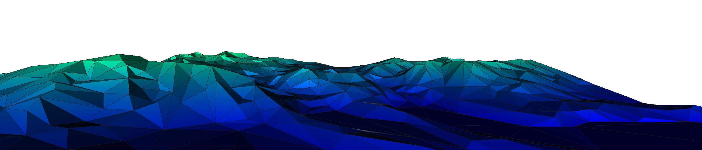
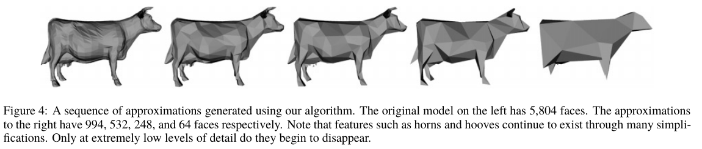
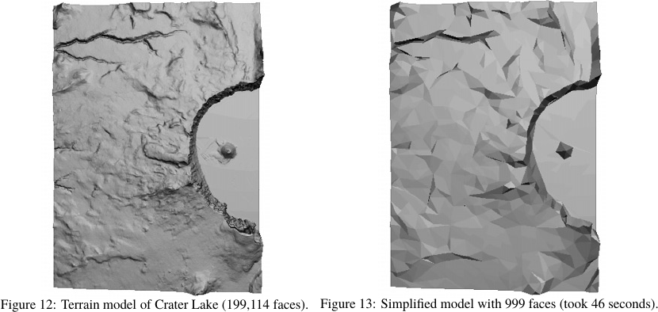
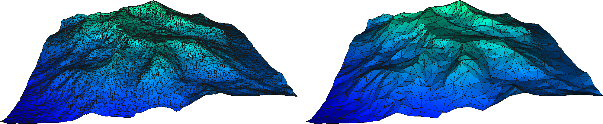

# Decimation
Blocky visualization of mountainous terrain


# Introduction
Nowadays, high resolution terrain maps are widely and freely available from tools like Google Earth and popular GPS apps. Here, rather than trying to maximize accuracy and realism, the aim is to create blocky terrain visualizations that look cool and preserve recognizable terrain features. Preexisting computer graphics tools are well suited for this.

In computer graphics, schemes to simplify complex mesh surfaces are important for reducing unnecessary processing time. One well known example is quadric decimation, devised by Garland and Heckbert in 1997. Shown below are two examples from their paper, one of a cow and one of a terrain map of Crater Lake. Their method merges vertices adaptively so that flat, unfeatured areas (cow torso, lake surface) undergo many merges, and comprise a few large faces, whereas complex features (horns, crater rim) remain well resolved with smaller faces.




This is an exploratory project. So far, the goal has been to create visualizations of my favorite mountain landscapes. The workflow constists of fetching terrain data from a public API, applying this decimation algorithm and then visualizing the results.

# Setup
It is easiest to make virtual environment (conda) and then install with pip.

```bash
# make a conda environment
conda create -n myenv pip python=3.9
conda activate myenv

# editable install
git clone git@github.com:gregbubnis/decimation.git
cd decimation
pip install -e .

# basic install
pip install git+https://github.com/gregbubnis/decimation
```

# Usage
Check out the demo jupyter notebook in `examples/`

# Gallery
#### Mt. Dana

